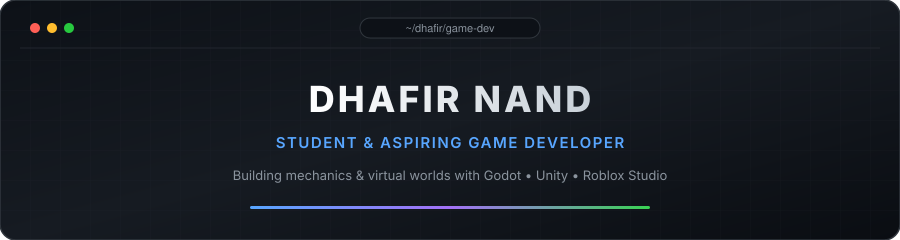

  

 

### dhafir
student & aspiring game dev. experimenting with godot, unity, and roblox studio.

📫 `dhafir.f2@gmail.com`

---

### 🕹️ Game Engines & Languages

  
  
  

---

### 🌐 Web & Tools

---

### 📊 GitHub Activity

  
  

